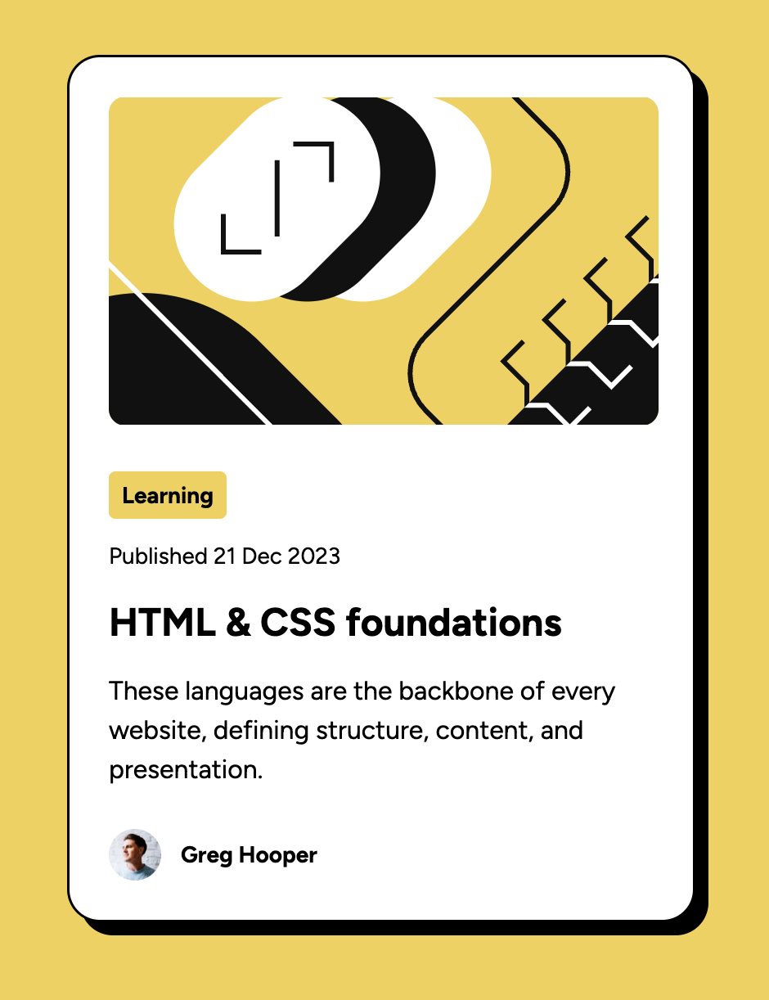

# Frontend Mentor - Blog preview card solution

This is a solution to the [Blog preview card challenge on Frontend Mentor](https://www.frontendmentor.io/challenges/blog-preview-card-ckPaj01IcS). Frontend Mentor challenges help you improve your coding skills by building realistic projects. 

## Table of contents

- [Frontend Mentor - Blog preview card solution](#frontend-mentor---blog-preview-card-solution)
  - [Table of contents](#table-of-contents)
  - [Overview](#overview)
    - [Screenshot](#screenshot)
  - [My process](#my-process)
    - [Built with](#built-with)
    - [What I learned](#what-i-learned)
    - [Continued development](#continued-development)
    - [Useful resources](#useful-resources)

## Overview

### Screenshot



## My process

### Built with

- Semantic HTML5 markup
- CSS custom properties
- Flexbox
- CSS Grid
- Media querry

### What I learned
Media querry to add breakpoints in my design:
```css
@media (max-width: 375px) {
  .class-to-change {
    font-size: var(--new-font-size);
  }
}
```
### Continued development

Get more understanding of responsive design. Media querries are a good way to add break points but CSS properties like `min-width` and `max-height` are seems to be a better way to handle screens size changes where I can use them. Grids could be usefull here as well.

### Useful resources

- [YT video - A practical guide to responsive web design by Kevin Powell](https://youtu.be/x4u1yp3Msao?si=dyFrveyjzX6TyOzX) - Nice intro to responsive design.
